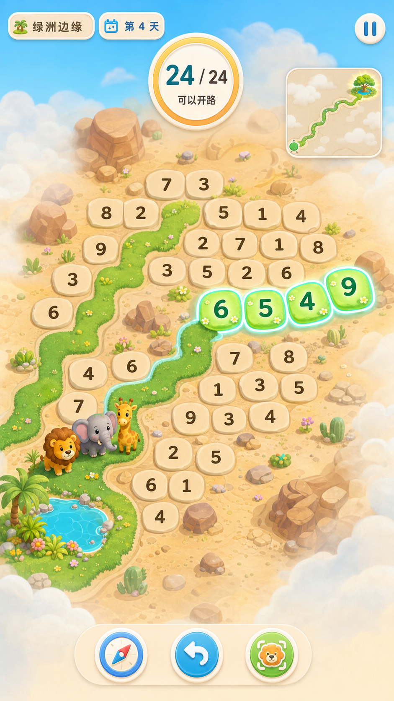
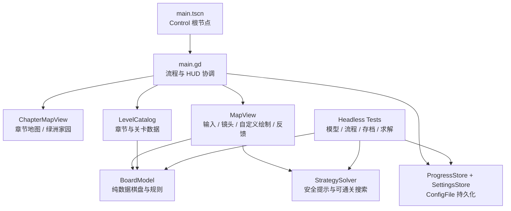
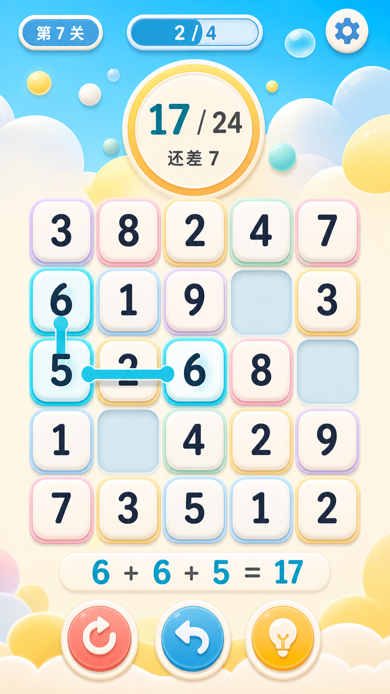

# Link24：绿洲迁徙

> 凑成 24，开出道路，带小动物走到下一片绿洲。

[](https://godotengine.org/)
[](LICENSE)
[](ASSETS_LICENSE.md)

<p align="center">
  <a href="https://dannyhan1119.github.io/Link24/"><strong>🎮 在线试玩 / Play Online</strong></a>
</p>

<p align="center">
  
  <br>
  <sub>当前美术方向概念图</sub>
</p>

### 29 秒实机演示

https://github.com/user-attachments/assets/5b004995-bb63-454e-b0d6-86cfe4538d7f

视频也发布在 [X / @dannykkg](https://x.com/dannykkg/status/2100095128941871322/video/1)。

## 这是一款什么游戏？

`Link24：绿洲迁徙` 是一款竖屏数字路径解谜游戏。

旱季到来，一支由狮子、幼象和长颈鹿组成的小队准备离开逐渐干涸的绿洲。他们的前方是沙地、岩石和云雾，脚下没有现成的路。

玩家需要从绿洲边缘出发，连接相邻数字，让路径之和恰好等于 **24**。成功的数字格会翻转成草地道路，动物们沿着新路前进，雾气随之散开。当一段段“24”最终连通棋盘外的新绿洲，这场迁徙才真正完成。

## 怎么玩

1. 从已经连通的道路边缘开始。
2. 拖动连接上下左右相邻的数字。
3. 路径总和恰好等于 24 时松手，沙地就会长出新路。
4. 在分岔、障碍和薄雾中规划下一段路，直到队伍抵达终点。

连线未达到 24 不会消耗步数，拖回上一格即可修正。游戏不设倒计时，也不会用随机失败惩罚玩家；难度来自“眼前这条路能走，但它会把队伍带向哪里”。

## 不只是 24 点

### 每次解题都在改变地图

正确答案不会消失，而会永久成为草地、花朵和队伍真正走过的路。通关后回看地图，能直接看到自己一步步留下的迁徙网络。

### 路线比算式更重要

同一时刻可能有多条路都能凑成 24，但更长的路能够一次开拓更多地格，支路可能藏着伙伴、水塘或瞭望点，看似直接的选择也可能让后续无路可走。

### 探索与恢复

雾中有迷路的居民、补给点和可选景观。获救动物会回到绿洲家园，通关成果会逐步恢复绿洲、解锁装饰。即使走入死局，也可以沿路撤回、请向导重整边界，或重新开始。

### 轻松通关，也能追求效率

故事线只要抵达绿洲就能继续。想要挑战的玩家则可以追求更少的“迁徙日”、不使用提示、救回伙伴并完成探索成果。

## 两章、20 个手工关卡

| 章节 | 主题 | 玩法进展 |
| --- | --- | --- |
| 第一章·绿洲边缘 | 学会开路 | 从第一段 24 路径开始，逐步引入岩石障碍、分岔、薄雾、伙伴救援和水塘补给。 |
| 第二章·明亮沙丘 | 用绕路换视野 | 新增可选瞭望点：多花一天点亮高处，能够永久驱散大片薄雾，让后续路线更易规划。 |

关卡采用固定布局，而不是临场随机生成。每关的唯一出口、主路、支路和特殊目标都经过完整求解验证，提示也只会指向已经证明能通关的选择。

关卡细节见 [第一章](docs/CHAPTER_01.md)、[第二章](docs/CHAPTER_02.md) 和 [20 关策略深度报告](docs/STRATEGY_REPORT.md)。

## 作为 Godot 学习 Demo

Link24 不仅是一个可玩的解谜原型，也是一个“规则驱动、代码优先”的 Godot 2D 项目示例。它展示了如何把一套可测试的游戏规则，与触摸输入、自定义绘制、动画反馈、存档和关卡验证组合成一个完整循环。

### 整体架构



| 层次 | 主要文件 | 职责与可学习点 |
| --- | --- | --- |
| 项目入口 | [`project.godot`](project.godot)、[`scenes/main.tscn`](scenes/main.tscn) | 设置 1080×1920 设计画布、竖屏与 `canvas_items` 拉伸策略；场景只保留一个全屏 `Control` 根节点。 |
| 流程协调 | [`src/main.gd`](src/main.gd) | 动态创建子视图，连接信号，切换章节/关卡/暂停/结算状态，并把模型变化映射到 HUD。 |
| 核心规则 | [`src/model/board_model.gd`](src/model/board_model.gd) | 不依赖具体 UI 节点的棋盘模型；负责相邻、求和、道路连通、特殊目标、通关与边界重整。 |
| 游戏表现 | [`src/ui/map_view.gd`](src/ui/map_view.gd) | 使用 `_gui_input()` 处理鼠标和触摸，使用 `_draw()` 绘制棋盘、道路、雾、角色、提示与粒子，并用 `queue_redraw()` 驱动可确定的帧更新。 |
| 章节界面 | [`src/ui/chapter_map_view.gd`](src/ui/chapter_map_view.gd) | 展示章节路线、解锁状态、恢复阶段和家园收集，通过信号把玩家选择交回主流程。 |
| 数据与存档 | [`level_catalog.gd`](src/model/level_catalog.gd)、[`progress_store.gd`](src/model/progress_store.gd)、[`settings_store.gd`](src/model/settings_store.gd) | 用 `Dictionary`、类型化数组和 `Vector2i` 定义关卡；用 `ConfigFile` 写入 `user://`，并演示存档版本迁移。 |
| 求解与测试 | [`strategy_solver.gd`](src/model/strategy_solver.gd)、[`tests/`](tests) | 用状态搜索找到可通关路线，并在 `--headless` 模式下测试规则、存档、UI 流程与多章节行为。 |

### 一次开路如何流过项目

1. `MigrationMapView._gui_input()` 把指针位置换算为 `Vector2i` 棋盘坐标。
2. 选中路径交给 `MigrationBoardModel.path_is_valid()` 检查前沿、相邻、重复、障碍和总和。
3. 总和为 24 时，`apply_path()` 只修改模型数据：数字格变成道路，特殊目标更新。
4. `MapView` 根据变化前后的状态启动动物移动、草路生长、薄雾消散、声音和触觉反馈。
5. 视图通过 `session_changed`、`objectives_changed` 和 `level_completed` 等信号通知 `main.gd`，主流程再刷新 HUD 或写入进度。

### 建议阅读顺序

1. 从 [`project.godot`](project.godot) 和 [`main.tscn`](scenes/main.tscn) 看项目如何启动。
2. 阅读 [`board_model.gd`](src/model/board_model.gd) 的 `path_is_valid()` 与 `apply_path()`，先理解与 UI 无关的核心规则。
3. 再跟踪 [`map_view.gd`](src/ui/map_view.gd) 中的 `_begin_pointer()` → `_update_selection_at()` → `_finish_pointer()` → `_commit_valid_path()`。
4. 回到 [`main.gd`](src/main.gd) 查看信号连接、关卡切换、安全区缩放和存档协作。
5. 最后阅读 [`test_board_model.gd`](tests/test_board_model.gd) 和 [`test_map_view_flow.gd`](tests/test_map_view_flow.gd)，看规则层与界面流程如何分别验证。

> **学习提示：** 这个项目刻意使用了较多代码自绘界面，而不是在编辑器中拆出大量节点和场景。它很适合学习 `Control` 自定义绘制、输入坐标映射、状态分层和无界面测试；如果你正在学习 Godot 以场景组合为主的常规工作流，可以把它当作另一种“代码驱动”实现的对照案例。

## 从“消掉数字”到“走出一条路”

Link24 最初只是一个简单的手机数字消除原型：在网格中连接数字，凑成 24，然后它们消失。核心规则很清楚，但“算完了又如何”一直没有令人满意的答案。

转折点是把“消除”改成“铺路”：数字不再只是要被清空的棋子，而是一块块等待被唤醒的沙地。24 点的计算、地图的探索和动物的前进因此变成了同一件事。

| 阶段 | 变化 |
| --- | --- |
| 早期原型 | 确立“连接相邻数字，总和恰好为 24”的基础操作。 |
| 迁徙改版 | 把消除格转化为永久道路，引入棋盘外绿洲、唯一出口和动物队伍。 |
| 第一章 | 完成 10 个教学与故事关，补齐薄雾、补给、救援、撤回和死局恢复。 |
| 多章节化 | 增加章节地图、稳定关卡 ID、跨章解锁、绿洲家园和第二章的瞭望点机制。 |
| 精确验证 | 引入完整求解器，穷尽可达局面，校验最优迁徙日、一步陷阱、提示安全性和难度曲线。 |
| 移动端打磨 | 加入 Android 导出、9:16 安全区、中英文、声音、震动和减少动态设置。 |

<table>
  <tr>
    <th>早期的数字消除界面</th>
    <th>现在的绿洲迁徙方向</th>
  </tr>
  <tr>
    <td></td>
    <td></td>
  </tr>
</table>

## 当前版本

- 两个可连续游玩的章节，共 20 关。
- 完整的进度保存、章节解锁、成果结算和绿洲家园。
- 分级提示、最多 20 步撤回、死局检测与可通关重整。
- 中英文界面，声音、震动与减少动态选项。
- macOS 开发运行与 Android `arm64-v8a` 调试导出。

这仍是一个持续开发中的作品：核心玩法与两章内容已经完整，美术、角色动画、地形变体和后续章节仍在逐步打磨。

## 运行项目

<details>
<summary>桌面端运行</summary>

使用 Godot 4.7 打开本目录，或在 macOS 中执行：

```sh
/Applications/Godot_mono.app/Contents/MacOS/Godot --path .
```

开发时可直接预览第二章：

```sh
/Applications/Godot_mono.app/Contents/MacOS/Godot \
  --path . -- --chapter=2 --play
```

</details>

<details>
<summary>Android 导出与真机调试</summary>

项目使用 Godot 4.7 Mono Android Gradle 模板，目标架构为 `arm64-v8a`。

```sh
./tools/export_android_debug.sh
./tools/run_android_debug.sh
```

导出产物位于 `build/android/Link24-debug.apk`。无线 ADB 与日志命令见 [`tools/android_device.sh`](tools/android_device.sh)。

</details>

<details>
<summary>自动测试与关卡验证</summary>

模型、界面、存档、多章节流程和策略求解器均有无界面测试。单项测试示例：

```sh
/Applications/Godot_mono.app/Contents/MacOS/Godot \
  --headless --path . --script res://tests/test_board_model.gd
```

全关卡最优解与策略深度校验：

```sh
/Applications/Godot_mono.app/Contents/MacOS/Godot \
  --headless --path . \
  --script res://tools/solve_analysis.gd -- --validate

/Applications/Godot_mono.app/Contents/MacOS/Godot \
  --headless --log-file /tmp/link24-strategy.log --path . \
  --script res://tools/solve_strategy.gd -- --validate
```

</details>

## 延伸资料

想继续了解玩法取舍、项目架构和美术规范，可以从以下文档开始：

- [完整迁徙玩法规划](docs/GDD_MIGRATION.md)
- [多章节架构](docs/MULTI_CHAPTER_ARCHITECTURE.md)
- [美术方向与资源清单](docs/ART_DIRECTION.md)
- [界面与交互规范](docs/UI_UX_SPEC.md)

## 参与贡献

欢迎提交玩法反馈、Bug 报告、关卡建议、可访问性改进、翻译和 Pull Request。开始前请阅读 [CONTRIBUTING.md](CONTRIBUTING.md)。

## 许可证

源代码使用 [MIT License](LICENSE)。`art/`、`audio/` 和 `docs/design/` 中的原创素材使用 [Creative Commons Attribution 4.0](ASSETS_LICENSE.md)。
